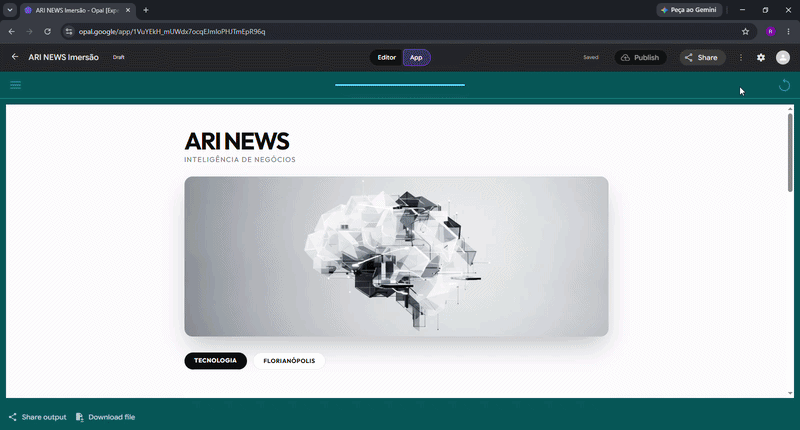
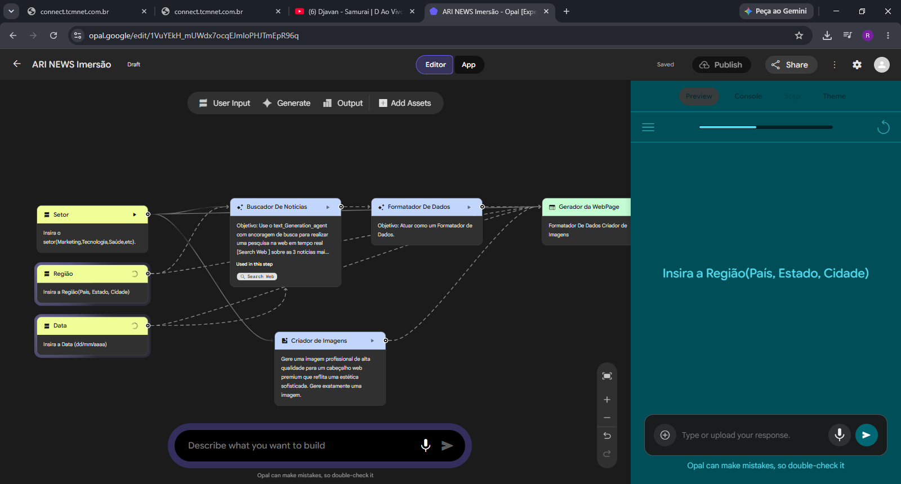
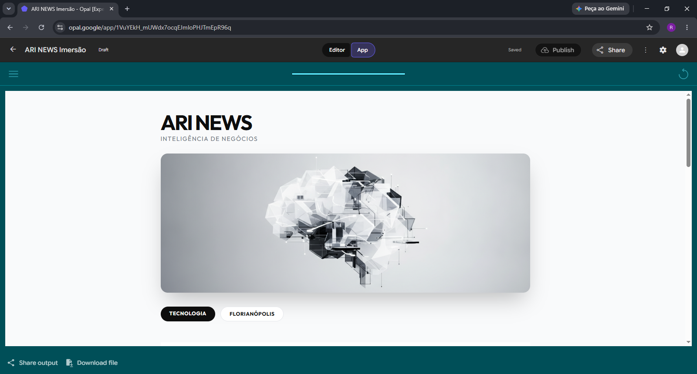

# 📰 Aula 01 — ARI News: Dashboard de Inteligência de Negócios

Projeto desenvolvido no primeiro dia da **Imersão IA (ONE + Alura AI for Business)**.

---

## 🎯 Objetivo
Apresentar a transição entre usar IA como uma "caixa de texto" e construir um **pipeline autônomo de agentes especializados**[cite: 1]. O ARI News é um dashboard que pesquisa notícias reais em tempo real, valida as fontes contra alucinações de links, gera uma imagem conceitual corporativa e renderiza uma página HTML completa[cite: 1, 4].

---

## 🎬 Demonstração da Aplicação em Funcionamento

---

## 🖼️ Mídia e Arquitetura

### Fluxo de Agentes no Google Opal

### Resultado Final Renderizado

---

## 🧱 Arquitetura dos Agentes & Lógica do Pipeline

O pipeline foi construído dividindo a inteligência em nós especializados conectados:

1. **User Inputs (Entrada):**
   - Captura dos parâmetros `Setor`, `Região` e `Data`[cite: 4].

2. **Buscador de Notícias (Nó 4):**
   - Agente equipado com ancoragem de busca web em tempo real (`text_generation_agent`).
   - **Grounding Temporal:** Restringe rigorosamente as notícias para fatos publicados a partir da data especificada pelo usuário.

3. **Formatador de Dados & Guardrails (Nó 6):**
   - **Validação Anti-Alucinação:** Para evitar links quebrados, transforma os títulos das notícias em slugs sanitizados e gera URLs de busca seguras do Google (`google.com/search?q=...`).

4. **Gerador de Hero Image (Nó 7):**
   - Agente gerador de imagem que cria uma arte conceitual, minimalista e abstrata do setor especificado, com garantia estrita de **zero texto na imagem**.

5. **Criador da Webpage (Nó 5):**
   - Agente especializado em desenvolvimento web que compila todas as saídas anteriores em um documento HTML/CSS autônomo e responsivo.
   - Atende às restrições rígidas da Política de Segurança de Conteúdo (CSP) da plataforma Opal.

---

## 📂 Prompts e Engenharia
Todos os prompts utilizados na configuração das System Instructions e mapeamento de variáveis de cada nó estão salvos na pasta [`/PROMPTS`](./PROMPTS).
