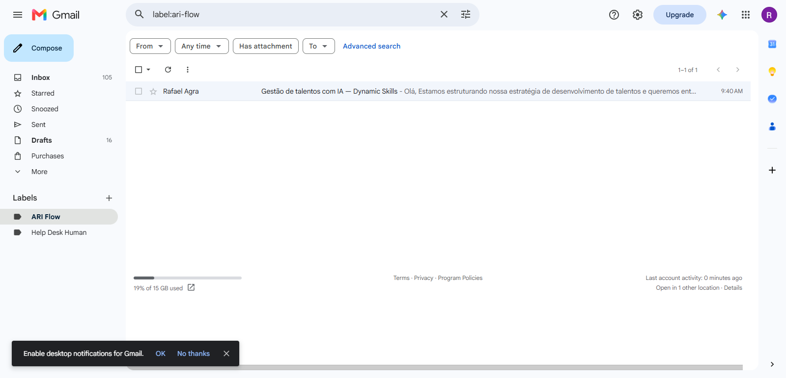
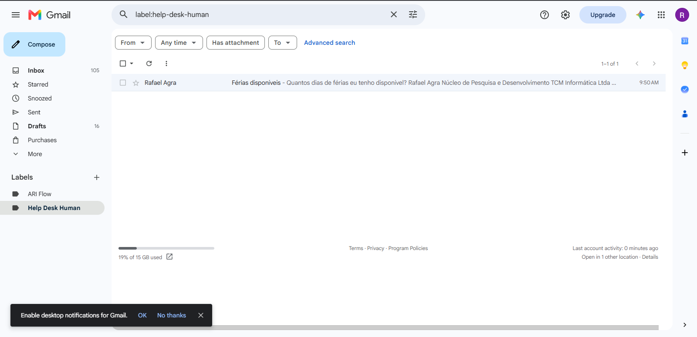

# 🤖 Aula 3: ARI Flow — Agente de Atendimento e Triagem Autônoma com IA e RAG

> **Imersão IA Alura + Google**
> *Módulo: Automação Autônoma sem Código com Make.com, Gemini AI, Gmail e Google Drive.*

---

## 📌 Sobre o Projeto

O **ARI Flow** é uma solução autônoma de Help Desk desenvolvida para monitorar a caixa de entrada do Gmail, classificar requisições em tempo real e responder dúvidas sobre a suíte **Oracle Cloud Applications** utilizando técnicas de **RAG (Retrieval-Augmented Generation)**, sem necessidade de intervenção humana.

A principal evolução trazida nesta aula é a transição do **RAG Assistido (Chat)**, em que o operador conduz a conversa, para o **RAG Autônomo (Automação)**, em que o agente opera 24 horas por dia, toma decisões de roteamento, consulta bases de conhecimento vivas e finaliza chamados de ponta a ponta.

---

## 🎯 Objetivos Concluídos

- [x] **Classificação Binária Eficiente:** uso do Google Gemini AI para determinar em segundos se o e-mail recebido contém uma dúvida técnica sobre Oracle Cloud Applications ou se pertence a outro assunto.
- [x] **Base de Conhecimento Viva (RAG):** conexão direta com arquivos armazenados no Google Drive, permitindo atualização constante da documentação sem alterar o fluxo no Make.
- [x] **Roteamento Inteligente:** separação das requisições entre resposta automática via Gemini (com formatação HTML) ou encaminhamento para atendimento humano na pasta `Help Desk Human`.
- [x] **Execução 24/7:** configuração de uma esteira de 7 nós no Make.com pronta para funcionar com agendamento automático a cada 15 minutos.

---

## 📐 Arquitetura do Fluxo no Make.com

O pipeline de automação conecta os serviços do ecossistema Google e a API do Gemini através da plataforma Make.com:

```text
               [ 1. Gmail: Watch Emails ]
                           │
                           ▼
             [ 4. Gemini: Classificador ]
                           │
                           ▼
                  [ 5. Router (Filtro) ]
                 ┌─────────┴─────────┐
                 │                   │
  (Se NÃO é dúvida Oracle)    (Se SIM, dúvida Oracle)
                 │                   │
                 ▼                   ▼
  [ 7. Gmail: Move para     [ 6. Google Drive: Baixa
   'Help Desk Human' ]        Manual de Conhecimento ]
                                     │
                                     ▼
                            [ 9. Gemini: Gera Resposta RAG ]
                                     │
                                     ▼
                            [ 10. Gmail: Envia Resposta HTML ]
                                     │
                                     ▼
                            [ 11. Gmail: Move para 'ARI Flow' ]
```

---

## 🛠️ Tecnologias e Ferramentas

| Ferramenta | Função no Projeto |
|------------|-------------------|
| **Make.com** | Orquestrador iPaaS responsável pela integração dos 7 nós de automação. |
| **Google Gemini AI** | Modelo de linguagem responsável pela classificação binária e pela geração da resposta RAG contextualizada. |
| **Gmail** | Gatilho (*Trigger*) para monitorar mensagens, enviar as respostas geradas e aplicar os marcadores organizacionais. |
| **Google Drive** | Repositório central da base de conhecimento (manuais técnicos da suíte Oracle Fusion Cloud). |

---

## 📂 Estrutura de Arquivos da Aula

```text
aula-3-ARI-Flow/
├── README.md
├── assets/
│   ├── fluxo_make.png              # Print da estrutura do fluxo montado no Make.com
│   ├── gmail_ari_flow.png          # Evidência do e-mail respondido e movido para a pasta ARI Flow
│   └── gmail_helpdesk_human.png    # Evidência do e-mail encaminhado para Help Desk Human
├── docs/
│   ├── Oracle Fusion Cloud Financials.md
│   ├── Oracle Fusion Cloud HCM.md
│   ├── Oracle Fusion Cloud Sales.md
│   └── Oracle Fusion Cloud Supply Chain.md
└── prompts/
    └── prompts_aula3.txt           # Instruções e prompts consolidados do Classificador e do Gerador RAG
```

---

## 📝 Prompts Utilizados

Todos os prompts abaixo estão consolidados no arquivo [`prompts/prompts_aula3.txt`](./prompts/prompts_aula3.txt).

### 1. Nó Classificador (Gemini AI)

**System Prompt:**

```text
Você é um especialista Oracle e classifique perguntas dos e-mails. Responda APENAS com SIM ou NAO. Nada mais.
```

**User Prompt:**

```text
Responda SIM se o email contém uma dúvida relacionada a Oracle Cloud Applications (HCM, ERP, SCM, CX, Financials, Supply Chain).

Responda NAO para qualquer outro assunto.

Assunto: {{1.subject}}
Corpo: {{1.snippet}}
```

### 2. Nó Gerador de Resposta RAG (Gemini AI)

**System Prompt:**

```text
Você é o ARI, especialista em Oracle Cloud Applications.
Responda em português do Brasil, linguagem de negócio, máximo 4 parágrafos.
Use apenas as informações do contexto fornecido.
Cite ao final de onde veio a informação.
Gere um texto final usando formato HTML para formatar o texto para que seja legível no email. De espaço entre os parágrafos.
```

**User Prompt:**

```text
CONTEXTO DA BASE DE CONHECIMENTO ORACLE:
{{6.data}}

DÚVIDA DO USUÁRIO:
Assunto: {{1.subject}}
Mensagem: {{1.snippet}}
```

---

## 🧪 Resultados dos Testes

### Cenário 1: Dúvida sobre o ecossistema Oracle (HCM / Talent Management)

- **Assunto:** "Gestão de talentos com IA — Dynamic Skills"
- **Resultado:** o Gemini classificou a mensagem como **SIM**. O fluxo obteve a documentação no Google Drive, gerou a resposta contextualizada em HTML e moveu a mensagem para o marcador `ARI Flow`.



### Cenário 2: Assunto não relacionado a Oracle Cloud (Dúvida Geral / RH)

- **Assunto:** "Férias disponíveis — Cuantos días de férias eu tenho"
- **Resultado:** o Gemini classificou a mensagem como **NAO**. O roteador direcionou o e-mail diretamente para a pasta `Help Desk Human` para tratamento manual.



---

## 🚀 Como Replicar este Fluxo

1. **Base de Conhecimento:** envie os arquivos Markdown da pasta `docs/` para um diretório no Google Drive.
2. **Gmail:** crie dois marcadores (*Labels*) na caixa do Gmail: `ARI Flow` e `Help Desk Human`.
3. **Make.com:**
   - Crie um novo cenário e monte a sequência de nós conforme o diagrama de arquitetura.
   - Configure a autenticação da API do Gemini (*API Key*).
   - Insira os prompts disponibilizados na pasta `prompts/`.
4. **Ativação:** faça um teste manual com e-mails de validação e ative o agendamento (*Scheduling*) para execução a cada 15 minutos.
